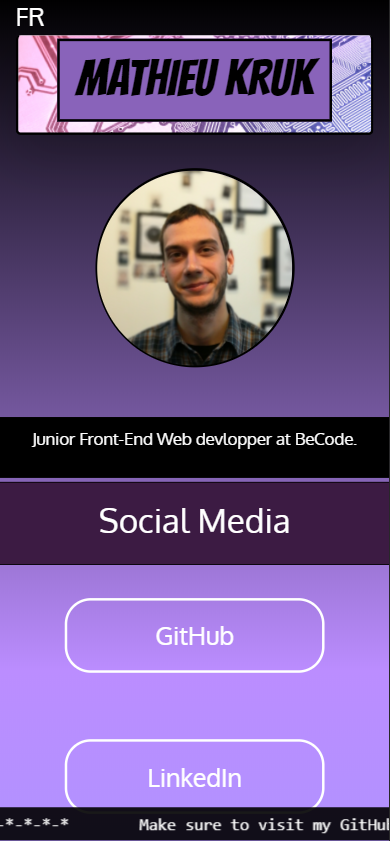

# LinkBase

## ◾ Features

<ul>
  <li>LinkBase is a static webpage made for personnal use.</li>
  <li>It regroups all my social media links together.</li>
</ul>

<hr>

<p align="center">
  
</p>

<hr>

## ◾ Motivation

It has been launch the 💠21/01/2020💠 in the case of looking for an intership after my formation at BeCode.org.

<hr>

## ◾ Tasks

- [x] Initialize the ReadMe and the trello.
- [x] Work on the main project.
- [X] Launch the page.

<hr>

## ◾ Build-status

📲 V1.0.1
Logs
   - Jumbotron
   - ENG/FR versions
   - GitHub link
   - LinkedIn link
   - Badgr link 
   - Behance link 
   - Animated ribbon. 

<hr>

## ◾ Screenshots

### A little preview:
<p align="center">
  
</p>

## ◾ Technology

1. Front-end
   - [HTML](https://www.w3.org/html/)
   - [SASS](https://sass-lang.com/)
   - [Bootstrap](https://getbootstrap.com/)
   - [Font-Awesome 4.7](https://fontawesome.com/v4.7.0/)
   - [Google Fonts](https://fonts.google.com/)
   - [Javascript](https://www.javascript.com/)

<hr>

## ◾ Code-Example

```
function test() {
  console.log("This is a test for code input?");
}
```

<hr>

## ◾ Credits

👨‍💻  [Mathieu Kruk](https://github.com/MathieuKruk)

<hr>

## ◾ License

OpenSource | Free

<hr>

<p align="right">
 ✍️ Readme Author:
  <br>
  <a href="https://github.com/MathieuKruk">Mathieu Kruk</a>
</p>

<p align="right">
  
</p>
